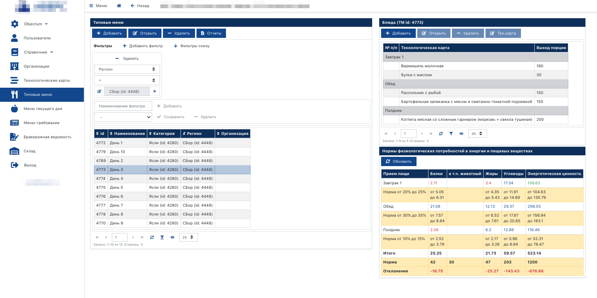
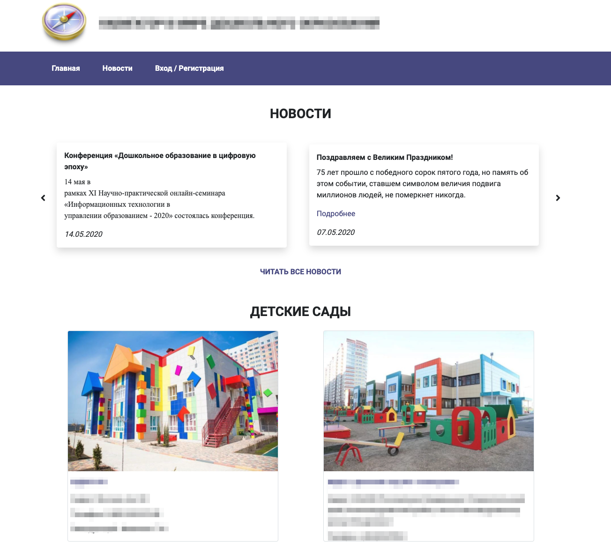
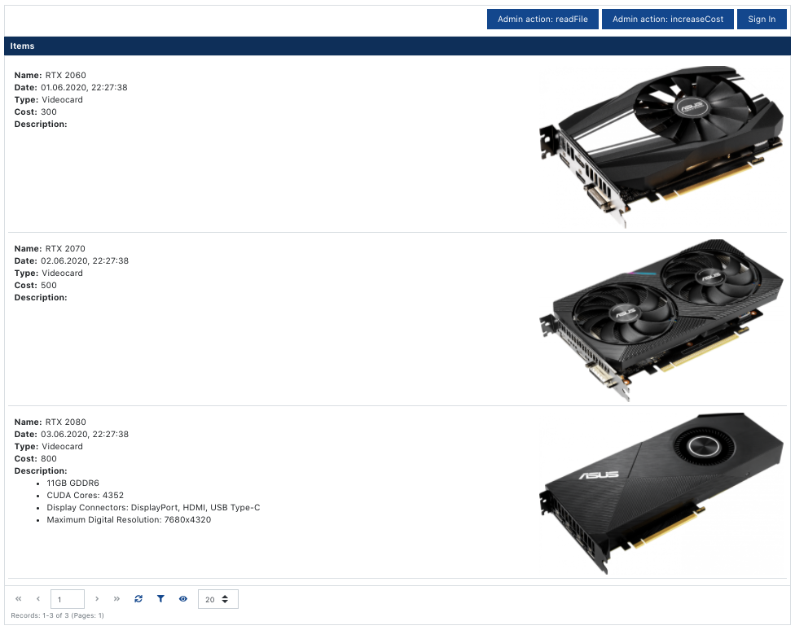
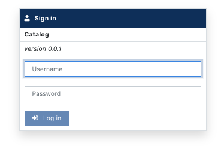
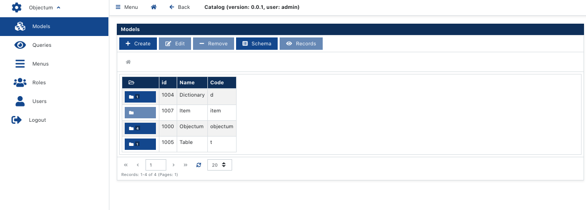
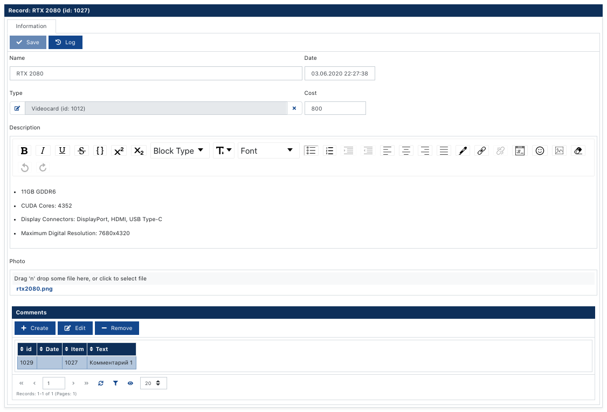

# Javascript платформа Objectum

Если вам нужен простой способ создавать веб-приложения, используя только javascript (full-stack), то предлагаю вам ознакомиться с платформой Objectum. Не уверен, что у меня всё сделано правильно, но эта новая версия платформы является результатом опыта работы над старой версией, которая используется 10 лет. Новая и старая версия используются в разработке различных информационных систем - это региональные решения и системы для организаций. Новая версия уже используется на продакшн серверах и будет поддерживаться длительное время. Далее подробности.

### Скрины из существующих разработок

Пример веб-приложения:

----------



----------

Пример сайта (без серверного рендера):

----------



----------


## Пакеты платформы 
   
Платформа состоит из следующих npm пакетов: [objectum](https://github.com/objectum/objectum), [objectum-client](https://github.com/objectum/objectum-client), [objectum-proxy](https://github.com/objectum/objectum-proxy), [objectum-react](https://github.com/objectum/objectum-react), [objectum-cli](https://github.com/objectum/objectum-cli)  

### objectum

Собственно сама платформа, сервер приложений. Реализован ORM для работы с PostgreSQL. Работает достаточно быстро благодаря набору триггеров и функций (Objectum Database Engine), написанных на PL/pgSQL. Кэширование в Redis. Может работать в node cluster. Изменения данных журналируются и в случае чего виновника найти не проблема.


### objectum-client

Изоморфный клиент для взаимодействия с objectum-proxy или objectum. Исходный код, работающий с хранилищем, без изменений можно запускать на клиенте или сервере.  

### objectum-proxy
Прокси расположен между objectum и objectum-client. Выполняет следующие задачи:
* Выполнение серверных методов моделей
* Выполнение серверных методов с правами администратора
* Контроль доступа к базе данных. Отслеживаются все действия - это действия CRUD и выборка данных через SQL.
* Загрузка и получение файлов

### objectum-react
Набор react компонентов UI. Используются bootstrap и fontawesome. Библиотеки redux, mobx не используются. 

### objectum-cli
Утилита командной строки. Выполняет сервисные действия с проектами, включая базы данных. Удобен для быстрого добавления моделей и записей.

# Разработка
Чтобы не быть многословным, в этой статье напишу о самом простом подходе, где не нужно создавать свои компоненты React. В своих проектах я стараюсь по максимуму всю систему сделать таким способом. Для сложных интерфейсов нужно писать свои компоненты, где удобно подключать компоненты из objectum-react.  
Теперь по порядку как создать проект objectum. Перед началом убедитесь, что у вас установлены NodeJS, PostgreSQL и Redis.  
Готовый демо-проект **catalog** вы можете установить [отсюда](https://github.com/objectum/catalog).

----------



----------


## Установка платформы 
Устанавливаем утилиту командной строки:
```bash
npm i -g objectum-cli
```
Устанавливаем платформу
```bash
mkdir /opt/objectum
objectum-cli --create-platform --path /opt/objectum
```
где параметры по умолчанию:
```
--redis-host 127.0.0.1 - хост и порт сервера Redis
--redis-port 6379
--objectum-port 8200 - порт, где будет работать objectum
```

## Создание проекта
Создаем проект "catalog":
```bash
objectum-cli --create-project catalog --path /opt/objectum
```
Параметры по умолчанию:
```
--project-port 3100 - порт, где будет работать проект
--db-host 127.0.0.1 - хост и порт сервера PostgreSQL
--db-port 5432
--db-dbPassword 1 - пароль пользователя catalog
--db-dbaPassword 12345 - пароль администратора postgres
--password admin - пароль администратора проекта
```

Папка проекта создается инструментом create-react-app. На клиенте и сервере модули подключаются как ES Modules.

## Запуск
Запуск платформы:
```bash
cd /opt/objectum/server 
node index-8200.js
```
Запуск проекта:
```bash
cd /opt/objectum/projects/catalog 
node index-3100.js
npm start
```
Должна открыться ссылка http://localhost:3000  
В окне авторизации в полях логин, пароль вводим: admin 

----------



----------


## Инструменты разработчика
Меню "Objectum" содержит пункты: 
* Модели - создание моделей и свойств
* Запросы - создание SQL запросов для выборки данных
* Меню - конструктор меню для ролей пользователей
* Роли - здесь задается список ролей пользователей
* Пользователи - добавление пользователей

----------



----------


## Пакетное добавление данных в хранилище
Структура хранилища формируется с помощью UI, но для быстрого добавления большого количества данных лучше использовать objectum-cli.  
<details>
<summary>Здесь скрипт catalog-cli.json</summary>

```json
{
    "createModel": [
        {
            "name": "Item", 
            "code": "item"
        },
        {
            "name": "Item", 
            "code": "item",
            "parent": "d"
        },
        {
            "name": "Type", 
            "code": "type",
            "parent": "d.item"
        },
        {
            "name": "Item", 
            "code": "item",
            "parent": "t"
        },
        {
            "name": "Comment", 
            "code": "comment",
            "parent": "t.item"
        }
    ],
    "createProperty": [
        {
            "model": "d.item.type", 
            "name": "Name", 
            "code": "name",
            "type": "string"
        },
        {
            "model": "t.item.comment", 
            "name": "Item", 
            "code": "item",
            "type": "item"
        },
        {
            "model": "t.item.comment", 
            "name": "Date",
            "code": "date",
            "type": "date"
        },
        {
            "model": "t.item.comment",
            "name": "Text",
            "code": "text",
            "type": "string"
        },
        {
            "model": "item", 
            "name": "Date", 
            "code": "date",
            "type": "date"
        },
        {
            "model": "item", 
            "name": "Name", 
            "code": "name",
            "type": "string"
        },
        {
            "model": "item",
            "name": "Description",
            "code": "description",
            "type": "string",
            "opts": {
                "wysiwyg": true
            }
        },
        {
            "model": "item", 
            "name": "Cost", 
            "code": "cost",
            "type": "number",
            "opts": {
                "min": 0
            }
        },
        {
            "model": "item", 
            "name": "Type", 
            "code": "type",
            "type": "d.item.type"
        },
        {
            "model": "item", 
            "name": "Photo", 
            "code": "photo",
            "type": "file",
            "opts": {
                "image": {
                    "width": 300,
                    "height": 200,
                    "aspect": 1.5
                }
            }
        }
    ],
    "createQuery": [
        {
            "name": "Item",
            "code": "item"
        },
        {
            "name": "List",
            "code": "list",
            "parent": "item",
            "query": [
                "{\"data\": \"begin\"}",
                "select",
                "    {\"prop\": \"a.id\", \"as\": \"id\"},",
                "    {\"prop\": \"a.name\", \"as\": \"name\"},",
                "    {\"prop\": \"a.description\", \"as\": \"description\"},",
                "    {\"prop\": \"a.cost\", \"as\": \"cost\"},",
                "    {\"prop\": \"a.date\", \"as\": \"date\"},",
                "    {\"prop\": \"a.photo\", \"as\": \"photo\"},",
                "    {\"prop\": \"a.type\", \"as\": \"type\"}",
                "{\"data\": \"end\"}",
                "",
                "{\"count\": \"begin\"}",
                "select",
                "    count (*) as num",
                "{\"count\": \"end\"}",
                "",
                "from",
                "    {\"model\": \"item\", \"alias\": \"a\"}",
                "",
                "{\"where\": \"empty\"}",
                "",
                "{\"order\": \"empty\"}",
                "",
                "limit {\"param\": \"limit\"}",
                "offset {\"param\": \"offset\"}"
            ]
        },
        {
            "name": "Item",
            "code": "item",
            "parent": "t"
        },
        {
            "name": "Comment",
            "code": "comment",
            "parent": "t.item",
            "query": [
                "{\"data\": \"begin\"}",
                "select",
                "    {\"prop\": \"a.id\", \"as\": \"id\"},",
                "    {\"prop\": \"a.item\", \"as\": \"item\"},",
                "    {\"prop\": \"a.date\", \"as\": \"date\"},",
                "    {\"prop\": \"a.text\", \"as\": \"text\"}",
                "{\"data\": \"end\"}",
                "",
                "{\"count\": \"begin\"}",
                "select",
                "    count (*) as num",
                "{\"count\": \"end\"}",
                "",
                "from",
                "    {\"model\": \"t.item.comment\", \"alias\": \"a\"}",
                "",
                "{\"where\": \"empty\"}",
                "",
                "{\"order\": \"empty\"}",
                "",
                "limit {\"param\": \"limit\"}",
                "offset {\"param\": \"offset\"}"
            ]
        }
    ],
    "createRecord": [
        {
            "_model": "d.item.type",
            "name": "Videocard",
            "_ref": "videocardType"
        },
        {
            "_model": "d.item.type",
            "name": "Processor"
        },
        {
            "_model": "d.item.type",
            "name": "Motherboard"
        },
        {
            "_model": "objectum.menu",
            "name": "User",
            "code": "user",
            "_ref": "userMenu"
        },
        {
            "_model": "objectum.menuItem",
            "menu": {
                "_ref": "userMenu"
            },
            "name": "Items",
            "icon": "fas fa-list",
            "order": 1,
            "path": "/model_list/item"
        },
        {
            "_model": "objectum.menuItem",
            "menu": {
                "_ref": "userMenu"
            },
            "name": "Dictionary",
            "icon": "fas fa-book",
            "order": 2,
            "_ref": "dictionaryMenuItem"
        },
        {
            "_model": "objectum.menuItem",
            "menu": {
                "_ref": "userMenu"
            },
            "name": "Item type",
            "icon": "fas fa-book",
            "parent": {
                "_ref": "dictionaryMenuItem"
            },
            "order": 1,
            "path": "/model_list/d_item_type"
        },
        {
            "_model": "objectum.role",
            "name": "User",
            "code": "user",
            "menu": {
                "_ref": "userMenu"
            },
            "_ref": "userRole"
        },
        {
            "_model": "objectum.user",
            "name": "User",
            "login": "user",
            "password": "user",
            "role": {
                "_ref": "userRole"
            }
        },
        {
            "_model": "objectum.menu",
            "name": "Guest",
            "code": "guest",
            "_ref": "guestMenu"
        },
        {
            "_model": "objectum.menuItem",
            "menu": {
                "_ref": "guestMenu"
            },
            "name": "Items",
            "icon": "fas fa-list",
            "order": 1,
            "path": "/model_list/item"
        },
        {
            "_model": "objectum.role",
            "name": "Guest",
            "code": "guest",
            "menu": {
                "_ref": "guestMenu"
            },
            "_ref": "guestRole"
        },
        {
            "_model": "objectum.user",
            "name": "Guest",
            "login": "guest",
            "password": "guest",
            "role": {
                "_ref": "guestRole"
            }
        },
        {
            "_model": "item",
            "name": "RTX 2060",
            "date": "2020-06-01T19:27:38.292Z",
            "type": {
                "_ref": "videocardType"
            },
            "cost": "300",
            "photo": "images/rtx2060.png"
        },
        {
            "_model": "item",
            "name": "RTX 2070",
            "date": "2020-06-02T19:27:38.292Z",
            "type": {
                "_ref": "videocardType"
            },
            "cost": "500",
            "photo": "images/rtx2070.png"
        },
        {
            "_model": "item",
            "name": "RTX 2080",
            "description": [
                "<ul>",
                "<li>11GB GDDR6</span></li>",
                "<li>CUDA Cores: 4352</span></li>",
                "<li>Display Connectors: DisplayPort, HDMI, USB Type-C</span></li>",
                "<li>Maximum Digital Resolution: 7680x4320</span></li>",
                "</ul>"
            ],
            "date": "2020-06-03T19:27:38.292Z",
            "type": {
                "_ref": "videocardType"
            },
            "cost": "800",
            "photo": "images/rtx2080.png"
        }
    ]
}
```
Что всё это значит:
* createModel - создание моделей, где name - наименование, code - текстовый идентификатор, parent - родитель. Иерархия используется для группировки моделей.
    * В примере создаются модели item, d.item.type, t.item.comment.
    * Модель "d.item.type" - это справочник. В модели "item" ссылка на справочник из свойства "type". Все справочники рекомендуется добавлять в узел "d". 
    * Модель "t.item.comment" - это табличная часть. Комментарии имеют ссылку на "item". Все табличные части рекомендуется добавлять в узел "t".
* createProperty - создание свойств моделей, где name - наименование, code - текстовый идентификатор, model - модель, type - тип данных в т.ч. ссылка на любую модель, opts - дополнительные параметры свойства, например, отображение текстового поля как wysiwyg редактор. 
* createQuery - создание SQL запросов с JSON вставками блоков, параметров, моделей, свойств.
    * [] - с помощью массива добавляется читаемый многострочный текст.
    * блоки {"...": "begin"}...{"...": "end"} помогают парсеру строить SQL запросы для различных целей: выборка (data), расчет кол-ва записей (count), фильтрация (where), сортировка (order), расчет кол-ва дочерних узлов (tree).
    * модель {"model": "item", "alias": "a"} конвертируется в название таблицы "код_id a".
    * свойство {"prop": "a.name"} конвертируется в название столбца "a.код_id".
    * параметр {"prop": "limit"} должен быть передан запросу при выполнении.
* createRecord - добавление записей моделей.
    * _model - модель
    * name - сохраняем любые свойства
    * [] - с помощью массива добавляется читаемый многострочный текст.
    * _ref - с помощью этой команды добавляем ссылки на другие записи т.к. заранее id записи неизвестно.
    * JSON конвертируется в текст.
    * "photo": "images/rtx2080.png" - добавление файлов. В photo запишется "rtx2080.png" и загрузится файл по относительному пути "images/rtx2080.png".

</details>

## Исходный код моделей
Исходный код ItemModel подключается на клиенте и сервере. Для добавления ReactJS или NodeJS кода нужно разделить код на ItemClientModel, ItemServerModel или на ItemModel, ItemClientModel extends ItemModel, ItemServerModel extends ItemModel.  

## Клиент
Подключение в App.js:
```js
import ItemModel from "./models/ItemModel";
 
store.register ("item", ItemModel);
```

Теперь создаваемые записи модели "item" будут экземплярами класса ItemModel:
```js
let record = await store.createRecord ({
    _model: "item",
    name: "Foo"
});
```
Что это дает:
* Прямое обращение к свойствам record.name = "Bar";
* Ссылка на хранилище record.store
* Сохранение изменений await record.sync ()

<details>
<summary>ItemModel.js</summary>

```jsx
import React from "react";
import {Record, factory} from "objectum-client";
import {Action} from "objectum-react";

class ItemModel extends Record {
    static _renderGrid ({grid, store}) {
        // Additional buttons in grid
        let actions = [
            ...grid.props.children,
            <Action label="Server action: getComments" onClickSelected={async ({progress, id}) => {
                let recs = await store.remote ({
                    model: "item",
                    method: "getComments",
                    id,
                    progress
                });
                return JSON.stringify (recs)
            }} />
        ];
        return React.cloneElement (grid, {
            label: "Items", // grid label
            query: "item.list", // grid query
            onRenderTable: ItemModel.onRenderTable, // grid table custom render
            children: store.roleCode === "guest" ? null : actions
        });
    }
    
    static onRenderTable ({grid, cols, colMap, recs, store}) {
        return (
            <div className="p-1">
                {recs.map ((rec, i) => {
                    let record = factory ({rsc: "record", data: Object.assign (rec, {_model: "item"}), store});
                    
                    return (
                        <div key={i} className={`row border-bottom my-1 p-1 no-gutters ${grid.state.selected === i ? "bg-secondary text-white" : ""}`} onClick={() => grid.onRowClick (i)} >
                            <div className="col-6">
                                <div className="p-1">
                                    <div>
                                        <strong className="mr-1">Name:</strong>{rec.name}
                                    </div>
                                    <div>
                                        <strong className="mr-1">Date:</strong>{rec.date && rec.date.toLocaleString ()}
                                    </div>
                                    <div>
                                        <strong className="mr-1">Type:</strong>{rec.type && store.dict ["d.item.type"][rec.type].name}
                                    </div>
                                    <div>
                                        <strong className="mr-1">Cost:</strong>{rec.cost}
                                    </div>
                                    <div>
                                        <strong>Description:</strong>
                                    </div>
                                    <div dangerouslySetInnerHTML={{__html: `${record.description || ""}`}} />
                                </div>
                            </div>
                            <div className="col-6 text-right">
                                {record.photo && <div>
                                     
                                </div>}
                            </div>
                        </div>
                    );
                })}
            </div>
        );
    }
    
    // item form layout
    static _layout () {
        return {
            "Information": [
                "id",
                [
                    "name", "date"
                ],
                [
                    "type", "cost"
                ],
                [
                    "description"
                ],
                [
                    "photo"
                ],
                [
                    "t.item.comment"
                ]
            ]
        };
    }
    
	static _renderForm ({form, store}) {
		return React.cloneElement (form, {
			defaults: {
				date: new Date ()
			}
		});
	}

    // new item render
    static _renderField ({field, store}) {
        if (field.props.property === "date") {
            return React.cloneElement (field, {showTime: true});
        } else {
            return field;
        }
    }

    // item render
    _renderField ({field, store}) {
		return ItemModel._renderField ({field, store});
    }
};

export default ItemModel;
```
</details>

В моделях зарезервированы названия методов для решения различных задач: 
* _renderGrid - модель "item" имеет отображение по умолчанию в маршруте /model_list/item. Отображает компонент ModelList, который вызывает данный метод при рендере Grid.
* _layout - запись отображает компонент ModelRecord, который вызывает данный метод для получения разметки. Если метод не определен, то макет формы используется стандартный, где все поля по одной на строку, а табличные части в отдельных закладках формы.
* _renderForm - рендер формы 
* _renderField - рендер поля. Статичный метод для новой записи и обычный метод для существующей записи.

Модифицированная форма:

----------



----------


## Сервер
Подключение в index.js:
```js
import ItemModel from "./src/models/ItemServerModel.js";
 
proxy.register ("item", ItemModel);
```

Методы и работа с хранилищем store такая же. Сессии между пользователями разделены.

<details>
<summary>ItemServerModel.js</summary>

```js
import objectumClient from "objectum-client";
const {Record} = objectumClient;

function timeout (ms = 500) {
    return new Promise (resolve => setTimeout (() => resolve (), ms));
};

class ItemModel extends Record {
    async getComments ({progress}) {
        for (let i = 0; i < 10; i ++) {
            await timeout (1000);
            progress ({label: "processing", value: i + 1, max: 10});
        }
        return await this.store.getRecs ({
            model: "t.item.comment",
            filters: [
                ["item", "=", this.id]
            ]
        });
    }
};

export default ItemModel;
```
</details>

С клиента серверные методы вызываются так:
```js
getComments () {
    return await store.remote ({
        model: "item",
        method: "getComments",
        myArg: "" 
    });
}
```

## Доступ
Подключение в index.js:
```js
import accessMethods from "./src/modules/access.js";
 
proxy.registerAccessMethods (accessMethods);
```

<details>
<summary>access.js</summary>

```js
let map = {
    "guest": {
        "data": {
            "model": {
                "item": true, "d.item.type": true, "t.item.comment": true
            },
            "query": {
                "objectum.userMenuItems": true
            }
        },
        "read": {
            "objectum.role": true, "objectum.user": true, "objectum.menu": true, "objectum.menuItem": true
        }
    }
};
async function _init ({store}) {
};

function _accessData ({store, data}) {
    if (store.roleCode == "guest") {
        if (data.model) {
            return map.guest.data.model [store.getModel (data.model).getPath ()];
        }
        if (data.query) {
            return map.guest.data.query [store.getQuery (data.query).getPath ()];
        }
    } else {
        return true;
    }
};

function _accessFilter ({store, model, alias}) {
};

function _accessCreate ({store, model, data}) {
    return store.roleCode != "guest";
};

function _accessRead ({store, model, record}) {
    let modelPath = model.getPath ();
    
    if (store.roleCode == "guest") {
        if (modelPath == "objectum.user") {
            return record.login == "guest";
        }
        return map.guest.read [modelPath];
    }
    return true;
};

function _accessUpdate ({store, model, record, data}) {
    return store.roleCode != "guest";
};

function _accessDelete ({store, model, record}) {
    return store.roleCode != "guest";
};

export default {
    _init,
    _accessData,
    _accessFilter,
    _accessCreate,
    _accessRead,
    _accessUpdate,
    _accessDelete
};
```
</details>

Любой запрос к хранилищу можно запретить или ограничить. Доступные методы:
* _init - инициализация модуля.
* _accessCreate - создание записей.
* _accessRead - чтение записей.
* _accessUpdate - изменений записей.
* _accessDelete - удаление записей.
* _accessData - выборка данных методом getData
* _accessFilter - для каждой модели в SQL запросе вызывается этот метод. Например ограничиваем конкретному пользователю выборку записей. Т.о. в любом новом запросе ограничения будут работать.

Действия можно запретить или ограничить, например разрешать изменять только набор свойств определенной роли.  
Создание, изменение, удаление моделей, свойств, запросов и столбцов доступно только суперпользователю admin.
    
## Действия администратора
Иногда нужно выполнить серверное действие с максимальными правами. Это может быть регистрация пользователя или какая-то обратная связь.  
Подключение в index.js:
```js
import adminMethods from "./src/modules/admin.js";
 
proxy.registerAdminMethods (adminMethods);
```

<details>
<summary>admin.js</summary>

```js
import fs from "fs";
import util from "util";

fs.readFileAsync = util.promisify (fs.readFile);

function timeout (ms = 500) {
    return new Promise (resolve => setTimeout (() => resolve (), ms));
};

async function readFile ({store, progress, filename}) {
    for (let i = 0; i < 10; i ++) {
        await timeout (1000);
        progress ({label: "processing", value: i + 1, max: 10});
    }
    return await fs.readFileAsync (filename, "utf8");
};

async function increaseCost ({store, progress}) {
    await store.startTransaction ("demo");
    
    let records = await store.getRecords ({model: "item"});
    
    for (let i = 0; i < records.length; i ++) {
        let record = records [i];
        
        record.cost = record.cost + 1;
        await record.sync ();
    }
    await store.commitTransaction ();
    
    return "ok";
};

export default {
    readFile,
    increaseCost
};
```
</details>

Как видно из admin.js. Здесь читаем файлы и меняем данные из под любой учетной записи пользователя (guest).  
С клиента вызов такой:
```js
await store.remote ({
    model: "admin",
    method: "readFile",
    filename: "package.json"
});
```

## Компоненты React
Библиотека содержит компоненты:
* ObjectumApp - веб-приложение  
* Auth - форма авторизации
* Grid - таблица
    * Параметр tree включает древовидную таблицу  
* Form - форма  
* Tabs, Tab - закладки  
* Fields - поля для разных типов данных  
    * StringField - строка. Есть опции: textarea, wysiwyg
    * NumberField - число
    * BooleanField - чекер
    * DateField - дата. Параметр showTime добавляет время.  
    * FileField - файл (изображение). Есть обрезание изображения перед загрузкой. 
    * DictField - выбор из справочника
    * SelectField - выбор из списка
    * ChooseField - ссылка на запись. Выбор элемента из другого компонента 
    * JsonField - составное поле. Содержит в себе любое количество полей различного типа. Значения сохраняются в виде строки JSON
    * Field - используется внутри формы. Тип поля выбирается автоматически  
    * JsonEditor - многострочный редактор JSON с выбором свойств 
* Tooltip - всплывающая подсказка
* Fade - анимация плавного отображения 
* Action - кнопка для выполнения функции 

## ObjectumApp

props:
* locale - локализация. Есть "ru".
* onCustomRender - свой рендер приложения
* username, password - автоматическая авторизация под выбранным пользователем (guest). 

### Grid
Для выборки данных компоненту нужно указать запрос (query) или модель (model). Предоставляет следующие функции:
* Сортировка по выбранному столбцу
* Фильтры по любым столбцам в соответствии с типом данных столбца  
    * Сохранение настроенных фильтров в localStorage
* Выбор отображаемых столбцов

### Form
Форма группирует поля. Позволяет сохранить изменения, и загрузить файлы. Кнопка "Изменения" в форме показывает таблицу изменений по выбранному полю. Видно какой пользователь, когда и с какого IP-адреса внес изменения.

### Action
Компонент предоставляет удобный запуск функций:
* Параметр confirm - подтверждение выполнения
* Функция может быть синхронной или асинхронной
* Во время выполнения:
    * Отображение прогресса выполнения, включая выполнение на сервере
    * Запрос подтверждения во время выполнения
    * В случае исключения показывает ошибку
* Показывает результат если функция вернула строку  

## Отчеты
Для построения несложных отчетов используется createReport, который строит XLSX отчет. Пример:
```js
import {createReport} from "objectum-react";

let recs = await store.getRecs ({model: "item"});
let rows = [
    [
        {text: "Список", style: "border_center", colSpan: 3}
    ],
    [
        {text: "Наименование", style: "border"},
        {text: "Дата", style: "border"},
        {text: "Стоимость", style: "border"}
    ],
    ...recs.map (rec => {
        return [
            {text: rec.name, style: "border"},
            {text: rec.date.toLocaleString (), style: "border"},
            {text: rec.cost, style: "border"}            
        ];
    })
];
createReport ({
    rows,
    columns: [40, 10, 10],
    font: {
        name: "Arial",
        size: 10
    }
});
```
Где:
* rows - это строки (row) отчета
* colSpan, rowSpan - работают как в HTML таблице
* columns - ширина колонок

## Развертывание

Платформа поддерживает виртуализацию хранилищ. База любого проекта экспортируется в файл и импортируется в другую базу. В новой базе у ресурсов создаются ссылки на оригинальную базу, по которым виртуализированная база обновляется в дальнейшем. Модели, свойства, запросы, записи создаются, изменяются или удаляются. Примеры использования:
* Я использую такую схему
    * БД catalog_dev - разработка
    * БД catalog_test (импорт из catalog_dev) - тестирование
    * БД catalog_"идентификатор клиента" (импорт из catalog_dev) - продакшн
* Общие и региональные справочники
    * БД region_dev - разработка и общие справочники
    * БД region_"идентификатор региона" (импорт из region_dev) - модификация общих справочников и добавление региональных параметров в справочники
    * БД region_"идентификатор клиента региона" (импорт из region_"идентификатор региона") - продакшн
* В одну БД можете импортировать несколько других БД, но в реальности мне это не понадобилось

Экспорт схемы catalog:
```js
let $o = require ("../../server/objectum");

$o.db.execute ({
    "code": "catalog",
    "fn": "export",
    "exceptRecords": ["item"],
    "file": "../schema/schema-catalog.json"
});
```

Параметр exceptRecords отключает экспорт записей по выбранным моделям, включая дочерние модели.

Импорт схемы:
```js
let $o = require ("../../../server/objectum");

$o.db.execute ({
    "code": "catalog_test",
    "fn": "import",
    "file": "../schema/schema-catalog.json"
});
```

## Производительность

В следующей таблице результаты тестирования наиболее трудоемкой функции - создание записей. Тестировалось на MacBook Pro Mid 2014 (MGX82).

Журналируемые модели (model.unlogged: false):
  
| Свойства                                       | 100 записей (сек.) | 1000 записей (сек.) | Записей в сек. |
|------------------------------------------------|--------------------|---------------------|----------------|
| Кол-во: 1, Число: 1                            | 0.5                | 4.9                 | 204            |
| Кол-во: 1, Строка: 1                           | 0.5                | 4.6                 | 215            |
| Кол-во: 1, Дата: 1                             | 0.5                | 4.4                 | 227            |
| Кол-во: 3, Число: 1, Строка: 1, Дата: 1        | 0.5                | 4.8                 | 209            |
| Кол-во: 10, Число: 10                          | 0.6                | 5.8                 | 172            |
| Кол-во: 10, Строка: 10                         | 0.6                | 7.1                 | 140            |
| Кол-во: 10, Дата: 10                           | 0.6                | 10.1                | 98            |
| Кол-во: 30, Число: 10, Строка: 10, Дата: 10    | 1.2                | 14.7                | 68            |
| Кол-во: 100 Число: 100                         | 2.3                | 27.3                | 37             |
| Кол-во: 100 Строка: 100                        | 2.4                | 24.1                | 42             |
| Кол-во: 100 Дата: 100                          | 2.3                | 24.6                | 40             |
| Кол-во: 300 Число: 100, Строка: 100, Дата: 100 | 8.9                | 88.3                | 11             

Нежурналируемые модели (model.unlogged: true):

  
| Свойства                                       | 100 записей (сек.) | 1000 записей (сек.) | Записей в сек. |
|------------------------------------------------|--------------------|---------------------|----------------|
| Кол-во: 1, Число: 1                            | 0.5                | 4.3                 | 233            |
| Кол-во: 1, Строка: 1                           | 0.4                | 4.1                 | 244            |
| Кол-во: 1, Дата: 1                             | 0.4                | 3.7                 | 268            |
| Кол-во: 3, Число: 1, Строка: 1, Дата: 1        | 0.5                | 3.8                 | 261            |
| Кол-во: 10, Число: 10                          | 0.5                | 4.1                 | 243            |
| Кол-во: 10, Строка: 10                         | 0.4                | 4.0                 | 251            |
| Кол-во: 10, Дата: 10                           | 0.4                | 4.2                 | 239            |
| Кол-во: 30, Число: 10, Строка: 10, Дата: 10    | 0.5                | 4.9                 | 202            |
| Кол-во: 100 Число: 100                         | 0.6                | 12.4                | 81             |
| Кол-во: 100 Строка: 100                        | 0.7                | 6.1                 | 162             |
| Кол-во: 100 Дата: 100                          | 0.9                | 7.2                 | 140             |
| Кол-во: 300 Число: 100, Строка: 100, Дата: 100 | 1.1                | 11.1                | 90             



По столбцам:
* в 1-м столбце указано количество свойств модели и типы данных
* во 2-м и 3-м  столбце указана продолжительность добавления записей
* в 4-м столбце количество создаваемых записей в секунду.

Скрипт /sample/test.js

## Заключение

Лицензия платформы MIT. Планируется разработка дополнительных пакетов по аналитике и другим нужным направлениям.  
Спасибо за внимание.
